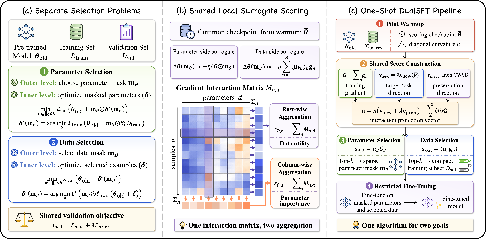

# ⚖️ DualSFT: Dual Scoring for Parameter and Data Selection in LLM Fine-Tuning

This is the public release for the paper: **"One Algorithm, Two Goals: Dual Scoring for Parameter and Data Selection in LLM Fine-Tuning"**.

## 📖 Overview
Large Language Model (LLM) fine-tuning typically treats all training examples and all trainable parameters equally. This can be inefficient when the useful supervision is sparse and only a subset of parameters is truly critical for adaptation.

**DualSFT** addresses this problem with a unified dual-scoring pipeline that selects both:

1. the most informative training data for downstream adaptation
2. the most valuable parameters to update during fine-tuning

The current public release implements a practical three-stage workflow:

1. **Warmup** on a small subset of the training set
2. **Selection** to compute parameter scores and data scores
3. **Restricted Fine-tuning** using the selected data subset and parameter mask




## 🎉 News
* Our paper has been accepted to **NeurIPS 2026**!


## 🚀 Quick Start

### 1. Installation
```bash
pip install -r requirements.txt
```

### 2. Prepare the Magicoder split
Place the raw Magicoder file at `train/datasets/Magicoder/data-evol_instruct-decontaminated.json`, then run:

```bash
bash scripts/01_prepare_magicoder_split.sh
```

This will generate:

- `train/datasets/Magicoder/magicoder_train.jsonl`
- `train/datasets/Magicoder/magicoder_val.jsonl`

### 3. Training
Before running the training scripts, replace the `...` placeholder in `MODEL_NAME_OR_PATH` with your local base model path.

#### Run the provided three-stage pipeline

```bash
# Stage 1: warmup
MODEL_NAME_OR_PATH=/path/to/Llama-3.2-3B \
bash scripts/02_warmup_llama32_magicoder.sh

# Stage 2: dual scoring and selection
MODEL_NAME_OR_PATH=/path/to/Llama-3.2-3B \
bash scripts/03_select_llama32_magicoder.sh

# Stage 3: restricted finetuning
MODEL_NAME_OR_PATH=/path/to/Llama-3.2-3B \
bash scripts/04_finetune_llama32_magicoder.sh
```


## 📂 Repository Structure

- `dualsft/`: core algorithm, scoring, masking, and data utilities
- `run_dualsft.py`: CLI entry point for the DualSFT workflow
- `prepare_magicoder_split.py`: utility for creating train/validation splits
- `scripts/`: shell templates for the three-stage DualSFT pipeline
- `train/scripts/`: sanitized baseline and LoRA training templates
- `train/datasets/Magicoder/`: dataset metadata and split templates


## 📝 Notes

- Machine-specific paths, usernames, and local training artifacts have been removed from this public release.
- Any remaining `...` placeholder must be replaced with your local path before running the corresponding script.
- Third-party frameworks, raw datasets, checkpoints, logs, and caches are intentionally not bundled.
- Baseline scripts under `train/scripts/` assume a separate installation of LlamaFactory.
